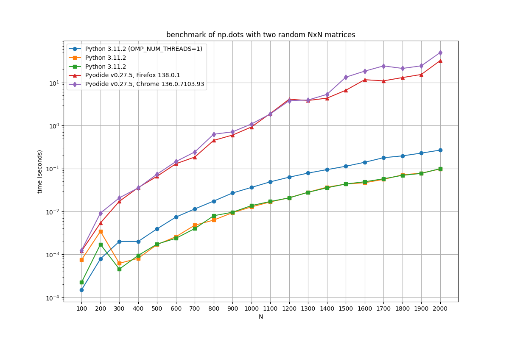
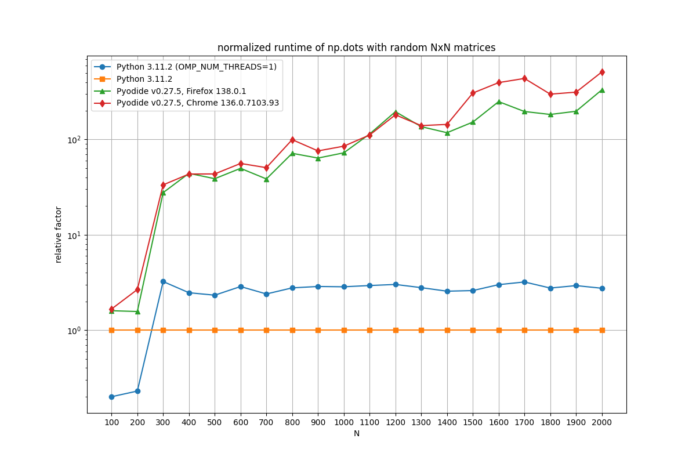

# Reverse Pyodide REPL

This is a simple experiment where Pyodide runs in the browser but commands are entered on the terminal where the Go webserver is started. It's not really as full-featured as the online demo REPL and was made to demonstrate the "browser as execution environment" use-case.

### usage

Start the webserver:

```
$ go run main.go
2025/05/13 10:01:27 starting server at http://localhost:8080
```

Open the page http://localhost:8080/ in a browser and wait a moment for Pyodide to load. You will see a notification about the connecting browser in the terminal. Each line of text you enter is sent and executed as a separate command. Only one active Pyodide Worker can be connected at a time.

```
$ go run main.go
2025/05/13 10:01:27 starting server at http://localhost:8080
2025/05/13 10:04:01 new pyodide worker connected: [::1]:59604
> [ n**2 for n in range(10) ]
[0, 1, 4, 9, 16, 25, 36, 49, 64, 81]
> 
```

### benchmark

Since Pyodide packages scientific computing libraries like numpy and pandas, I decided to use a simple dot product of two random matrices as a simple "benchmark". The tested function looks like this:

```python
import numpy as np
from timeit import timeit

def dots(n):
  A, B = np.random.random((n, n)), np.random.random((n, n))
  return timeit(lambda: np.dot(A, B), number=10) / 10.0
```

These are the results for `n = 100 .. 2000` on an Intel i5-1345U with Python running inside a WSL2 machine. Let's just say .. **more than two orders of magnitude slower** is no good.




